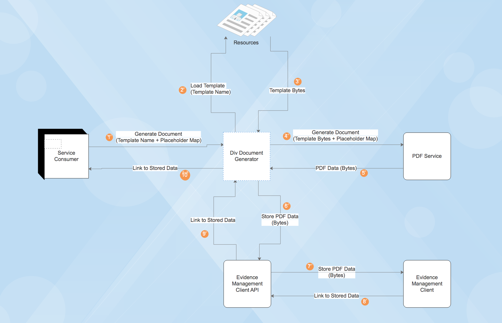

# Document Generator

[](https://opensource.org/licenses/MIT)
[](https://travis-ci.org/hmcts/div-document-generator-client)
[](https://codecov.io/gh/hmcts/div-document-generator-client)
[](https://tools.hmcts.net/confluence/display/DIV/Add+a+new+template+to+DGS)

This is a document generation and template management service. This allows to generate documents based on a
given template name and placeholder data in JSON format and will also store the generated document in the
Evidence Management Store.

The service provides a single RESTful endpoint that will generate the document, store it in Evidence Management
Store and return the link to the stored data.

## Setup

**Prerequisites**

- [JDK 11](https://openjdk.java.net/)
- [Docker](https://www.docker.com)

**Building**

The project uses [Gradle](https://gradle.org) as a build tool but you don't have to install it locally since there is a
`./gradlew` wrapper script.

To build project please execute the following command:

```bash
./gradlew build
```

## Running and Testing

To run this locally follow the steps below and configure `application-aat.yml`.
Then run the service using `./gradlew clean bootRunAat`.

**Integration tests**

To run all integration tests locally (note the location of config files):

1. Make a copy of `src/main/resources/example-application-aat.yml` as `src/main/resources/application-aat.yml`
2. Make a copy of `src/integrationTest/resources/example-application-local.properties` as `src/integrationTest/resources/application-local.properties`
3. Replace the `replace_me` secrets in the _newly created_ files. You can get the values from SCM and Azure secrets key vault
   (the new files are in .gitignore and should ***not*** be committed to git)
4. Assuming you use IntelliJ, run your application
5. Then run functional tests
6. Or using command line:
    1. Start the app with AAT config using `./gradlew clean bootRunAat`
    2. Start the test with AAT config using `./gradlew clean functional`

**IMPORTANT:** If you update content in [templates](https://github.com/hmcts/rdo-docmosis-templates),
you will likely need to re-generate PDFs by running the ignored test `PDFGenerationTest.ignoreMe_updateGeneratedPdfs`.
The generated PDFs will be placed into `src/integrationTest/resources/documentgenerator/documents/regenerated`.

These PDFs are used in integration tests, and you will use them to replace files in `src/integrationTest/resources/documentgenerator/documents/pdfoutput`.

Pipeline uses `pdfoutput` in its tests, so you will need to replace `pdfoutput` PDFs with the newly `regenerated` PDFs of the
templates you have changed. Make sure you have followed steps above, and are able to run functional tests.

**Unit tests**

To run all unit tests please execute following command:

```bash
./gradlew test
```

**Coding style tests**

To run all checks (including unit tests) please execute following command:

```bash
./gradlew check
```

**Mutation tests**

To run all mutation tests execute the following command:

```bash
./gradlew pitest
```

## Developing

**Flow Diagram**



**API documentation**

API documentation is provided with Swagger:
 - `http://localhost:4007/swagger-ui.html` - UI to interact with the API resources

**Versioning**

We use [SemVer](http://semver.org/) for versioning.
For the versions available, see the tags on this repository.

**Standard API**

We follow [RESTful API standards](https://hmcts.github.io/restful-api-standards/).

## License

This project is licensed under the MIT License - see the [LICENSE.md](LICENSE.md) file for details.
